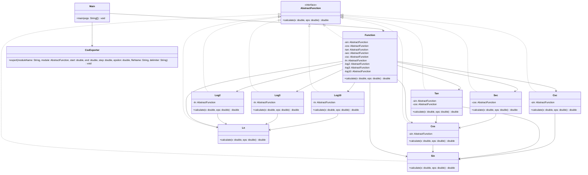
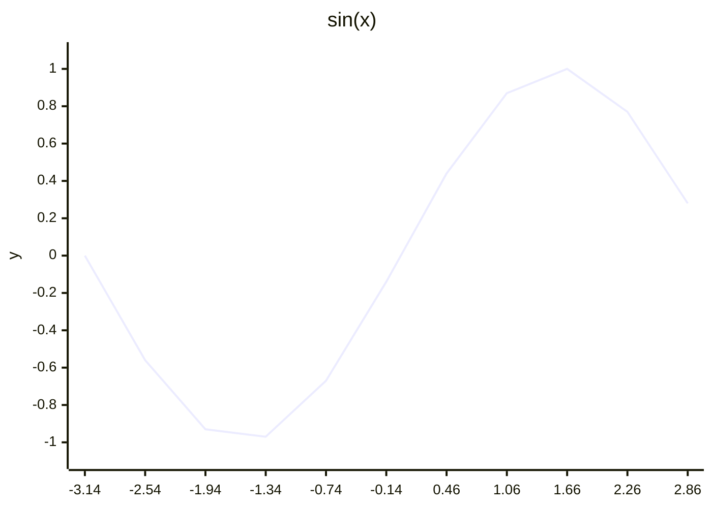
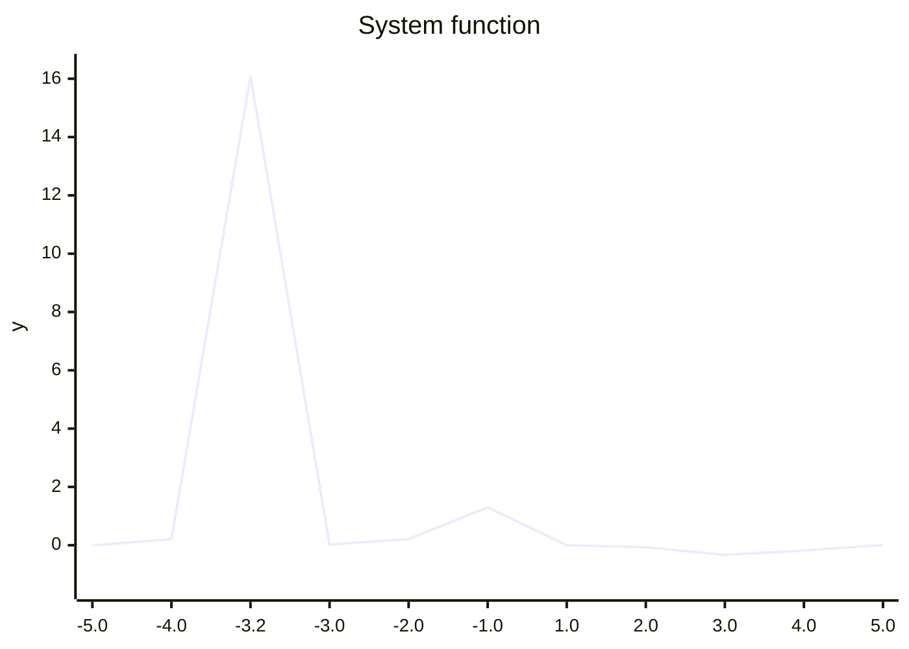

# Отчёт по лабораторной работе

## Текст задания

Разработать приложение для вычисления системы функций и её составляющих, соблюдая следующие требования:

- все тригонометрические и логарифмические функции системы должны быть выражены через базовые;
- базовые функции `sin(x)` и `ln(x)` должны быть реализованы разложением в ряд с задаваемой погрешностью;
- использовать тригонометрические и логарифмические преобразования для упрощения функций запрещено;
- для каждого модуля должны быть реализованы табличные заглушки;
- необходимо определить области допустимых значений функций и взаимозависимые точки;
- приложение должно позволять выгружать значения любого модуля в CSV-файл с произвольным шагом по `x`;
- необходимо разработать тестовое покрытие, выполнить интеграцию приложения по одному модулю и контролировать тестовое покрытие.

## Система функций

В приложении реализована система:

\[
f(x)=
\begin{cases}
\dfrac{(((\sec x-\sec x)+\sec x \cdot \sin x)\cdot \cos x)-(\sin x \cdot \csc x)}{\tan x}, & x \le 0 \\
\dfrac{(((\log_2 x-\log_2 x)+\log_2 x \cdot \log_{10} x)\cdot \log_3 x)-(\log_3 x \cdot \ln x)}{\log_3 x}, & x > 0
\end{cases}
\]

Базовые функции:

- `sin(x)` реализована рядом Тейлора;
- `ln(x)` реализована степенным рядом с использованием преобразования `z = (x - 1) / (x + 1)`.

Остальные функции выражены через базовые:

- `cos(x) = sin(x + pi / 2)`;
- `tan(x) = sin(x) / cos(x)`;
- `sec(x) = 1 / cos(x)`;
- `csc(x) = 1 / sin(x)`;
- `log2(x) = ln(x) / ln(2)`;
- `log3(x) = ln(x) / ln(3)`;
- `log10(x) = ln(x) / ln(10)`.

## Области допустимых значений

- `sin(x)`, `cos(x)` определены на всей числовой прямой.
- `tan(x)`, `sec(x)` определены при `x != pi / 2 + pi * k`.
- `csc(x)` определена при `x != pi * k`.
- `ln(x)`, `log2(x)`, `log3(x)`, `log10(x)` определены при `x > 0`.
- Логарифмическая ветвь системы дополнительно не определена при `x = 1`, так как `log3(1) = 0`.

## UML-диаграмма классов



## Описание тестового покрытия

### Выбранная стратегия

Использована стратегия интеграции `bottom-up`.

Она выбрана потому, что зависимости направлены от базовых функций к производным:

- `sin -> cos -> tan/sec`;
- `sin -> csc`;
- `ln -> log2/log3/log10`;
- все перечисленные модули затем собираются в `Function`.

Такой подход позволяет сначала проверить устойчивость базовых модулей, затем по одному подключать составные функции и на каждом шаге подтверждать корректность интеграции.

### Модульное тестирование

Модульные тесты расположены в файлах:

- `src/test/java/org/example/math/SinTest.java`
- `src/test/java/org/example/math/LnTest.java`
- `src/test/java/org/example/math/CosTest.java`
- `src/test/java/org/example/math/TanTest.java`
- `src/test/java/org/example/math/SecTest.java`
- `src/test/java/org/example/math/CscTest.java`
- `src/test/java/org/example/math/Log2Test.java`
- `src/test/java/org/example/math/Log3Test.java`
- `src/test/java/org/example/math/Log10Test.java`
- `src/test/java/org/example/FunctionTest.java`

Все они используют данные из CSV-файлов в `src/test/resources/testdata`.

Для изоляции зависимостей применяется табличная заглушка `TableFunctionStub`, которая позволяет задавать значения функций на выбранных точках.

### Интеграционное тестирование

Интеграционные тесты сосредоточены в файле:

- `src/test/java/org/example/IntegrationTest.java`

В нём реализована поэтапная интеграция:

1. тестирование `sin`;
2. интеграция `cos`;
3. интеграция `tan`;
4. интеграция `sec`;
5. интеграция `csc`;
6. тестирование `ln`;
7. интеграция `log2`, `log3`, `log10`;
8. интеграция полной системы `Function`.

### Обоснование выбора тестов

В тестовые данные включены:

- корректные значения внутри ОДЗ;
- нули функций;
- точки разрыва;
- характерные углы для тригонометрии;
- значения левее и правее критических границ;
- специальные точки зависимости:
  `sin(x) = 0`, `cos(x) = 0`, `log3(x) = 0`.

Эквивалентные классы:

- для `sin`, `cos`: произвольные действительные числа и точки периодичности;
- для `tan`, `sec`: допустимые точки и точки, где `cos(x)=0`;
- для `csc`: допустимые точки и точки, где `sin(x)=0`;
- для логарифмов: `x <= 0`, `0 < x < 1`, `x = 1`, `x > 1`;
- для системы: отрицательная ветвь, положительная ветвь, особые точки и точка `x = 1`.

После расширения CSV-наборов количество репрезентативных точек увеличено: добавлены дополнительные значения внутри ОДЗ, периодические точки, отрицательные и положительные контрольные значения, а также дополнительные сценарии для обеих ветвей системы.

## Контроль покрытия

Покрытие собирается JaCoCo при запуске `mvn test`.

По текущему файлу `target/site/jacoco/jacoco.csv`:

- `Function` покрыта полностью по строкам;
- `Sin`, `Cos`, `Tan`, `Sec`, `Csc`, `Ln`, `Log2`, `Log3`, `Log10` покрыты полностью по строкам;
- `Main` покрыт частично;
- `CsvExporter` покрыт частично, так как инфраструктурные тесты экспорта были удалены по текущему запросу.

## Графики по CSV-выгрузкам

Графики построены по файлам:

- `csv-output/sin.csv`
- `csv-output/ln.csv`
- `csv-output/system.csv`

### График `sin(x)`



График подтверждает корректную периодическую форму синуса.

### График `ln(x)`

```mermaid
xychart-beta
    title "ln(x)"
    x-axis [0.1, 0.5, 1.0, 2.0, 4.0, 6.0, 8.0, 10.0]
    y-axis "y" -2.5 --> 2.5
    line [-2.30, -0.69, 0.00, 0.69, 1.39, 1.79, 2.08, 2.30]
```

График отражает характерный рост натурального логарифма на области `x > 0`.

### График системы функций



По графику видно различие поведения отрицательной и положительной ветвей, а также наличие особой точки в области `x = 1`.

## Выводы по работе

В ходе работы:

- реализована система функций с базовыми функциями `sin(x)` и `ln(x)`, вычисляемыми через ряды;
- все составные функции выражены через базовые без запрещённых упрощающих преобразований;
- реализован экспорт значений модулей в CSV;
- разработаны табличные заглушки для тестирования;
- выполнено модульное и интеграционное тестирование;
- реализована поэтапная интеграция системы по стратегии `bottom-up`;
- тестовые наборы вынесены в CSV и расширены дополнительными контрольными точками.

Итоговая система корректно собирается, проходит тестирование и позволяет анализировать поведение модулей как по тестовым сценариям, так и по CSV-выгрузкам.
