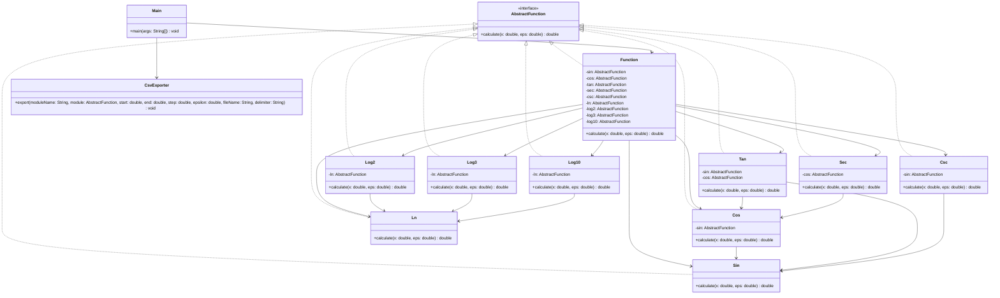
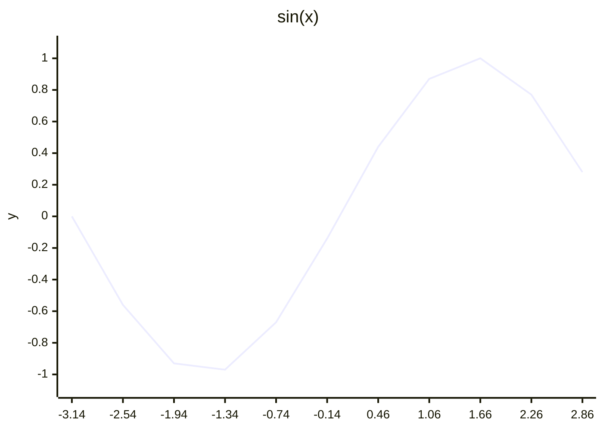
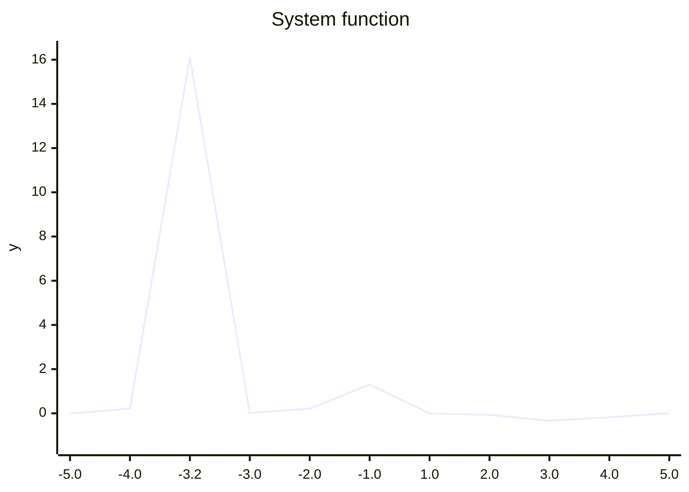

# Отчёт по лабораторной работе

## Текст задания

Разработать приложение для вычисления системы функций и её составляющих, руководствуясь следующими требованиями:

- все тригонометрические и логарифмические функции системы должны быть выражены через базовые;
- базовые функции `sin(x)` и `ln(x)` должны быть реализованы разложением в ряд с задаваемой погрешностью;
- использовать тригонометрические и логарифмические преобразования для упрощения функций запрещено;
- для каждого модуля должны быть реализованы табличные заглушки;
- необходимо определить области допустимых значений функций и взаимозависимые точки;
- приложение должно позволять выгружать значения любого модуля в CSV-файл с настраиваемым шагом по `x`;
- необходимо разработать модульные и интеграционные тесты, выполнить интеграцию по одному модулю и контролировать покрытие.

## Система функций

В разработанном приложении реализована следующая система:

\[
f(x)=
\begin{cases}
\dfrac{(((\sec x-\sec x)+\sec x \cdot \sin x)\cdot \cos x)-(\sin x \cdot \csc x)}{\tan x}, & x \le 0 \\
\dfrac{(((\log_2 x-\log_2 x)+\log_2 x \cdot \log_{10} x)\cdot \log_3 x)-(\log_3 x \cdot \ln x)}{\log_3 x}, & x > 0
\end{cases}
\]

Базовые функции:

- `sin(x)` реализована рядом Тейлора;
- `ln(x)` реализована степенным рядом через преобразование `z = (x - 1) / (x + 1)`.

Производные функции:

- `cos(x)` выражена через `sin(x + pi / 2)`;
- `tan(x)` выражена как `sin(x) / cos(x)`;
- `sec(x)` выражена как `1 / cos(x)`;
- `csc(x)` выражена как `1 / sin(x)`;
- `log2(x)`, `log3(x)`, `log10(x)` выражены через `ln(x)`.

Области допустимых значений:

- `sin(x)`, `cos(x)`: определены на всей числовой прямой;
- `tan(x)`, `sec(x)`: `x != pi / 2 + pi * k`;
- `csc(x)`: `x != pi * k`;
- `ln(x)`, `log2(x)`, `log3(x)`, `log10(x)`: `x > 0`;
- логарифмическая ветвь системы дополнительно не определена при `x = 1`, так как `log3(1) = 0`.

## UML-диаграмма классов



## Описание тестового покрытия

### Выбранная стратегия тестирования

Покрытие построено в два слоя:

- модульное тестирование для проверки каждого модуля в изоляции;
- интеграционное тестирование для пошаговой сборки системы снизу вверх.

Стратегия интеграции выбрана `bottom-up`, потому что граф зависимостей направлен от базовых функций к составным:

- `sin -> cos -> tan/sec`;
- `sin -> csc`;
- `ln -> log2/log3/log10`;
- все перечисленные модули затем используются в `Function`.

Такой подход позволяет сначала подтвердить корректность базовых вычислений, а затем заменять заглушки реальными реализациями по одному модулю.

### Модульные тесты

Модульные тесты находятся в файлах:

- `src/test/java/org/example/math/SinTest.java`
- `src/test/java/org/example/math/LnTest.java`
- `src/test/java/org/example/math/CosTest.java`
- `src/test/java/org/example/math/TanTest.java`
- `src/test/java/org/example/math/SecTest.java`
- `src/test/java/org/example/math/CscTest.java`
- `src/test/java/org/example/math/Log2Test.java`
- `src/test/java/org/example/math/Log3Test.java`
- `src/test/java/org/example/math/Log10Test.java`
- `src/test/java/org/example/FunctionTest.java`

Для изоляции модулей используется табличная заглушка `TableFunctionStub`. Тестовые данные вынесены в CSV-файлы в `src/test/resources/testdata`.

### Интеграционные тесты

Интеграционные тесты сосредоточены в файле:

- `src/test/java/org/example/IntegrationTest.java`

В нём последовательно проверяются следующие этапы интеграции:

1. подключение базового `sin`;
2. интеграция `cos`;
3. интеграция `tan`;
4. интеграция `sec`;
5. интеграция `csc`;
6. подключение базового `ln`;
7. интеграция `log2`, `log3`, `log10`;
8. проверка полной системы `Function`.

### Обоснование набора тестов

В покрытие включены:

- корректные точки внутри ОДЗ;
- точки разрыва и запрещённые значения;
- граничные случаи для ветвления системы по условию `x <= 0` и `x > 0`;
- взаимозависимые точки, в которых один модуль зависит от нулевого значения другого:
  `cos(x) = 0`, `sin(x) = 0`, `log3(x) = 0`.

Эквивалентные классы:

- для `sin` и `cos`: произвольные действительные числа, а также точки периодичности;
- для `tan` и `sec`: допустимые точки и точки, где `cos(x) = 0`;
- для `csc`: допустимые точки и точки, где `sin(x) = 0`;
- для `ln` и логарифмов: `x <= 0`, `0 < x < 1`, `x = 1`, `x > 1`;
- для системы: отрицательная ветвь, положительная ветвь, точки разрыва и точка `x = 1`.

### Контроль покрытия

Контроль покрытия выполняется JaCoCo при запуске `mvn test`.

По текущему отчёту `target/site/jacoco/jacoco.csv`:

- все математические модули `Sin`, `Cos`, `Tan`, `Sec`, `Csc`, `Ln`, `Log2`, `Log3`, `Log10`, а также `Function` покрыты по строкам полностью;
- `Main` покрыт почти полностью: `25` строк покрыто, `1` строка пропущена;
- `CsvExporter` покрыт частично, так как после удаления инфраструктурных тестов основное внимание сосредоточено на тестировании системы функций.

## Графики по CSV-выгрузкам

CSV-файлы, использованные для построения графиков:

- `csv-output/sin.csv`
- `csv-output/ln.csv`
- `csv-output/system.csv`

### График `sin(x)`

Построен по данным из `csv-output/sin.csv`.



График соответствует ожидаемой синусоиде и подтверждает корректность базовой тригонометрической функции.

### График `ln(x)`

Построен по данным из `csv-output/ln.csv`.

```mermaid
xychart-beta
    title "ln(x)"
    x-axis [0.1, 0.5, 1.0, 2.0, 4.0, 6.0, 8.0, 10.0]
    y-axis "y" -2.5 --> 2.5
    line [-2.30, -0.69, 0.00, 0.69, 1.39, 1.79, 2.08, 2.30]
```

График отражает типичную форму натурального логарифма: быстрый рост на малых `x` и замедление роста при увеличении аргумента.

### График системы функций

Построен по данным из `csv-output/system.csv`.



По графику видны:

- существенные изменения поведения на отрицательной ветви;
- переход к логарифмической ветви при `x > 0`;
- особая точка около `x = 1`, где значение становится неопределённым по формуле системы.

## Выводы

В ходе работы было разработано приложение для вычисления системы функций, в котором:

- базовые функции `sin(x)` и `ln(x)` реализованы через разложение в ряд с управляемой погрешностью;
- все производные тригонометрические и логарифмические функции выражены через базовые;
- реализован экспорт значений любого модуля в CSV;
- построены табличные заглушки для модульного тестирования;
- проведена поэтапная интеграция системы по стратегии `bottom-up`;
- подготовлено тестовое покрытие с анализом ОДЗ, граничных случаев и взаимозависимых точек.

Полученные CSV-выгрузки и графики показывают, что поведение функций соответствует ожидаемой математической модели, а интеграционные тесты подтверждают корректность сборки полной системы из отдельных модулей.
